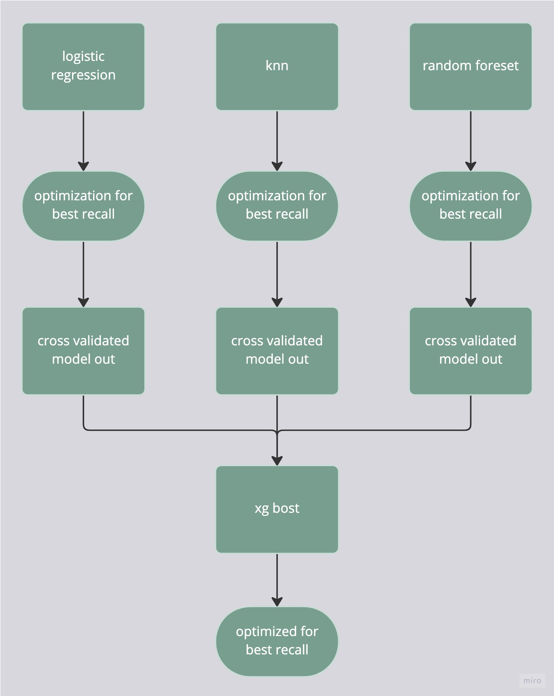

# Fraud Transaction Classification

Model classifies transactions into fraud and not fraud

Implemented by stacking :
- Logisatic regression
- K nearest neighbors
- Random forest classifier 

an xgboost classifier used on top of the stacked model

